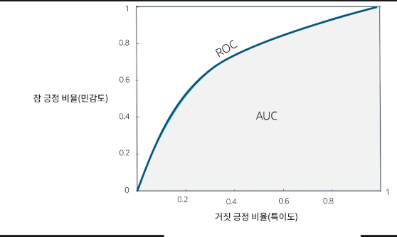

# Developing Machine Learning Solutions (Korean)
## 기계 학습 개발 수명 주기
- ML 수명 주기는 기계 학습 모델을 개발, 배포, 유지 관리하는 엔드 투 엔드 프로세스를 나타냄
- 엔드 투 엔드 기계 학습 수명 주기 프로세스에 포함되는 단계
1. 비즈니스 목표 식별
    - ML은 비즈니스 목표에서 시작됨, 비즈니스 이해 관계자가 가치, 예산, 성공 기준을 정의함, ML 워크로드에 대한 성공 기준 또는 핵심 성과 지표(KPI)를 정의하는 것은 매우 중요함
2. ML 문제 프레이밍(공식화)
    - 비즈니스 문제를 명확하게 표현하고 이를 ML 문제로 전환하는 작업이 포함됨
    - 데이터 과학자, 데이터 엔지니어, ML 아키텍트는 LOB(Line of Business) 주제 전문가(SME)와 협력하여 ML을 통해 비즈니스 문제를 해결하는 것이 적절한지 여부를 결정함, 이 단계에서 팀은 검색 작업을 수행할 수 있음, 팀에서 비즈니스 솔루션을 성공적으로 제공하는 데 적절한 데이터, 스킬 등을 갖추고 있는지 여부를 판단함 
3. 데이터 처리(데이터 수집, 데이터 전치리 및 특성 추출)
    - 데이터를 사용 가능한 형식으로 변환함
    - 데이터 처리 단계 : 데이터 수집 및 통합, 데이터 전처리 및 데이터 시각화, 특성 추출이 포함됨
        - 데이터 수집 및 통합 : 원시 데이터를 한 곳에서 중앙 집중식으로 액세스할 수 있도록 보장함
        - 데이터 전처리 및 데이터 시각화 : 원시 데이터를 이해하기 쉬운 형식으로 변환하는 작업이 포함됨
        - 특성 추출 : 데이터에서 변수를 생성,변환, 추출 및 선택하는 프로세스 
4. 모델 개발(훈련,튜닝 및 평가)
    - 워크플로 전체에서 여러 번 수행할 수 있는 반복적인 프로세스 
    - 처음 훈련시 모델에서 예상한 결과를 산출하지 않음, 따라서 개발자는 재훈련 전에 추가 특성 추출을 수행하고 모델 하이퍼파라미터를 튜닝함
5. 모델 배포(추론 및 예측)
    - 결과가 만족스러우면 모델을 프로덕션에 배포, 모델에 대한 예측 및 추론을 수행할 준비가 되었다는 뜻뜻
6. 모델 모니터링
    - 조기 탐지 및 완화를 통해 모델에서 원하는 수준의 성능을 유지하고 이쓴지 확인합니다. 모니터링은 문제를 디버그하고 모델의 동작을 이해하는 데도 도움이 됩니다.
7. 모델 재훈련
    - 모델에서 비즈니스 목표를 충족하지 못하는 경우 데이터와 특성을 다시 검토하여 모델을 개선할 방법을 찾아야함. 모델 빌드는 일반적으로 반복적인 프로세스 임, 여기에는 훈련 하이퍼파라미터 조정이 포함될수도 있습니다. 
- 반복 : ML LC는 반복적인 프로세스임, 새 데이터를 사용할 수 있게 되거나 요구 사항이 변경됨에 따라 모델은 지속적으로 개선되고 세분화 됩니다. 이 반복적 특성은 시간이 지나면서 모델에서 정확성과 관련성을 유지할 수 있도록 하는데 도움이 됩니다.

## Amazon SageMaker를 사용하여 ML 솔루션 개발
### Amazon SageMaker
- 완전관리형 ML 서비스로 단일 통합 비주얼 인터페이스에서 수행할 수 있는 테스크는 다음과 같다
1. 데이터를 수집하고 준비한다
2. ML 모델을 빌드하고 훈련합니다.
3. 모델을 배포하고 예측 성능을 모니터링 합니다.

- Amazon SageMaker를 사용해 ML 워크플로에서 데이터를 수집부터 모델 배포까지 수행할 수 있음
1. 데이터 수집,분석 및 준비
- Amazon SageMaker의 Data Wrangler는 로코드 노코드(LCNC) 도구임, 웹 인터페이스를 사용해 데이터 크롤링과 전처리할 수 있는 엔드 투 엔드 솔루션을 제공함, 고객은 자신만의 Python 스크립트 및 변환을 추가하여 워크플로를 사용자 지정할 수 있음
- 고급 사용자 및 대규모 데이터 준비를 위해 Amazon SagerMaker Studio Classic에는 Amazon EMR및 AWS Glue 대화형 세션이 기본적으로 제공되고 통합되어 SageMaker Studio Classic 노트북 내에서 대규모 대화형 데이터 준비 및 기계 학습 워크플로를 처리함
- SageMaker Processing API를 사용하면 고객이 스크립트와 노트북을 실행하여 데이터세트를 처리,변환,분석 할 수 있음, 완전관리형 기계 학습 환경의 이점을 활용하면 scikit-learn,MXNet 또한 Pytorch와 같은 다양한 ML 프레임워크를 사용할 수 있음
    - 해당 단계가 끝나면 고객은 일반적으로 모델을 정의하기 위한 특성과 모델을 훈련하기 위한 데이터를 갖게 됨

2. 특성 관리
- Amazon SageMaker Feature Store를 사용하면 데이터 과학자,ML 엔지니어 및 일반 실무자가 ML 개발을 위한 특성을 생성, 공유,관리할 수 있음
- 저장소에 저장된 특성은 추론을 위해 ML 모델에 제공되기 전에 검색하고 보강할 수 있음

3. 모델 훈련 및 평가
- 기본 제공 알고리즘 또는 사용자 지정 알고리즘을 사용해 모델을 훈련하고 배포하는 훈련 작업 특성을 제공함
- ML 컴퓨팅 인스턴스를 시작하고 훈련 코드 및 훈련 데이터세트를 사용하여 모델을 훈련함, 나중에 추론에 사용할 수 있는  Amazon Simple Storage Service(S3) 버킷에 결과 모델 아티팩트를 저장함
- LCNC 옵션을 목표로 하는 고객은 Amazon Sagemaker Canvas를 사용할 수 있음, 코드를 작성할 필요 없이 기계학습을 사용해 예측을 생성할 수 있음
- Amazon SageMaker JumpStart는 고객이 다양한 문제 유형에 사용할 수 있는 사전 훈련된 오픈 소스 모델을 제공함

4. 모델 평가
- Amazon SageMaker Experiments를 사용하여 데이터, 알고리즘 및 파라미터의 몇 가지 조합을 실험하면서 점진적 변경이 모델 정확도에 미치는 영향을 관찰할 수 있음
- 하이퍼파라미터 튜닝은 모델의 최적 버전을 찾는 방법입니다. Amazon SageMaker 자동 모델 튜닝은 다양한 하이퍼파라미터를 조합하여 여러 작업을 실행하고 선택한 지표로 각 작업을 측정하여 최적 버전을 찾음

5. 배포
-  ML 모델을 배포하여 추론이라고도 하는 예측을 수행할 수 있습니다. SageMaker는 모든 ML 추론 요구 사항을 충족하는 데 도움이 되는 다양한 ML 인프라 옵션과 모델 배포 옵션을 제공

6. 모니터링
- Amazon SageMaker Model Monitor를 사용하면 고객은 프로덕션 환경에서 SageMaker ML 모델의 품질을 관찰할 수 있음
- 지속적인 모니터링 또는 일정에 따라 모니터링을 설정할 수 있습니다. SageMaker Model Monitor는 데이터 품질, 모델 품질, 편향 드리프트 및 특성 속성 드리프트에 대한 사용자 정의 임계값 위반을 탐지하여 모델 품질을 유지하는 데 도움이 됨됨

#### SageMaker 환경
- SageMaker Studio :이 웹 기반 인터페이스를 통해 데이터 준비와 모델 훈련, 배포, 모니터링과 같이 ML 애플리케이션을 개발하는 데 사용할 수 있는 모든 작업에 액세스할 수 있습니다.
- SageMaker Studio는 다음과 같은 다양한 애플리케이션을 제공합니다.
    - JupyterLab: Jupyter 노트북, 코드, 데이터를 개발하는 도구 
    - Amazon SageMaker Canvas: 코드를 작성하지 않고도 예측을 생성할 수 있는 노코드 기계 학습 도구
    - RStudio: R 언어용 통합 개발 환경
    - 코드 편집기(Visual Studio Code 기반): 수천 개의 VS Code 호환 확장에 액세스하면서 코드와 노트북을 개발할 수 있는 또 다른 옵션
- 자동화된 ML
    - SageMaker JumpStart는 기계 학습을 시작하는 데 도움이 되는 다양한 문제 유형에 대해 사전 훈련된 오픈 소스 모델을 제공합니다.
    - AutoML은 SageMaker Canvas에서 사용할 수 있습니다. 기계 학습 모델을 빌드하고 배포하는 프로세스를 자동화하여 ML 개발을 간소화합니다.
    - 모델 평가는 모델 품질과 책임에 대해 대규모 언어 모델(LLM) 또는 생성형 인공 지능(생성형 AI)을 살펴봅니다.

## ML 모델 소스
### 모델 구현
- SageMaker는 사전 훈련된 모델, 기본 제공 알고리즘 및 사용자 지정 Docker 이미지를 지원함
- ML 모델을 빌드하는 방법
    - 사전 훈련된 모델은 최소한의 노력을 필요로 하며 SageMaker JumpStart를 사용해 배포하거나 미세 조정하고 배포할 준비가 된 모델
    - 데이터세트가 크고 모델을 훈련하고 배포하는데 상당한 리소스가 필요한경우 Sagemaker에서 사용할 수 있는 기본 제공 모델에는 더 많은 노력과 확장이 필요함
    - 기본 제공 솔루션이 없는 경우 scikit-learn, TensorFlow, PyTorch, MXNet 또는 Chainer와 같은 지원되는 프레임워크에 대한 기계 학습 및 딥 러닝 프레임워크를 위해 사전 생성된 이미지를 사용하는 솔루션을 개발함
    - 필요한 패키지 또는 SW를 설치하도록 ㅜㅅ겅된 고유한 사용자 지정 Docker 이미지를 빌드할 수 있음

### SageMaker 기본 제공 알고리즘
- 지도 학습
- 비지도 학습
- 이미지 처리
- 텍스트 분석

### SageMaker JumpStart
- 가장 인기 있는 모델 허브에서 사전 훈련된 모델을 배포, 미세조정 및 평가할 수 있음

## 기계 학습 모델 성능 평가
### 모델 평가
- 분류와 회귀에 사용할 수 있는 지표 살펴보자
#### 모델 평가 데이터세트
- 검증 집합
    - 비훈련 환경에서 모델이 반응하는 방식에 대한 평가를 시작하려면 먼저 검증 집합으로 남겨둔 데이터를 살펴봅니다. 모델에서 아직 확인하는 데이터로 일반화 하도록 해야함
- 테스트 집합
    - 검증 데이터를 사용하여 모델을 개선한 후에는 예측 품질이 표준을 충족하는지 확인하기 위해 마지막으로 테스트

### 편향 및 분산
- 편향 : 예측 값과 실제 값 사이의 격차
- 분산 : 예측 값이 분산된 정도
- ML에서 이상적인 알고리즘은 편향이 낮고, 실제 관계를 정확하게 모델링할 수 있음, 이상적인 알고리즘은 여러 데이터세이트에서 일관된 예측을 생성하여 변동성을 낮춤
- 높은 분산 : 과대적합
- 높은 편향 : 과소 적합
- 편향과 분산 낮음 : 균형 적합 모델

### 분류 회귀 문제
- 모델 평가 지표
- 분류 모델 : 정확도, 정밀도, 재현율, F1, AUC-ROC
- 회귀 모델 : 평균 제곱 오차, R 제곱

#### 분류 문제 지표
- 분류 예 이미지 인식 모델에서 데이터를 고양이 또는 고양이 아님 레이블로 지정하는 이진 분류 문제 
1. 목표 값을 알고 있는 보류된 관찰 값을 모델에 보냄
2. 모델에서 반환한 예측값을 레이블과 비교
3. 예측 값과 실제 값이 일치하는 정도를 요약 지표로 만들어서 계산함

#### 혼동 행렬
- 모델에서 문제가 발생하는 이유와 방법을 분류하는 데 도움이 될 수 있음
- 분류 문제에 대해 이러한 유형의 모델 평가를 실행하기 위한 구성 요소 
- 참 긍정 (TP) : 예측값도 +, 클래스도 +
- 거짓 부정 (FN) : 예측값 + , 클래스 -
- 거짓 긍정 (FP) : 예측값 - , 클래스 +
- 참 부정 (TN) : 예측값 - , 클래스 -

#### 정확도
- TP + TN / (TP + FN + FP + FN) 
- 널리 사용되는 지표지만 제한적임, 데이터세트에 참 부정이 많은 경우이 지표 효과가 떨어짐, 이런 상황에 정밀도와 재현율이라는 두 가지 다른 피죠가 사용되는 경우가 많음

#### 정밀도
- 부정확한 에측을 제거함, 정밀도는 긍정적인 에측 중 실제로 맞는 예측의 비율임, 참 금정수를 사용하고 총 긍정수로 나누어 계산할 수 있음
- TP/(TP+FP)

#### 제현율
- 재현율(민감도) 에서는 긍정으로 식별되는 올바른 집합의 비율을 살펴보는 것, 재현율은 참 긍정 수를 참 긍정과 거짓 부정의 합으로 나누어 계산함, 이 비율을 보면 알고리즘에서 해당 객체를 얼마나 잘 탐지 하는지 알 ㅅ ㅜ있음
- TP/(TP+FN)

#### AUC-ROC
- ROC는 확률 곡선, AUC는 분리 가능성의 정도 또는 측정값을 나타냄
- 민감도(참 긍정 비율) 및 특이도 (거짓 긍정 비율)를 사용하는 AUC-ROC

### 회귀 문제 지표
#### MSE(평균 제곱 오차)
- 목적은 분류 지표와 동일함, 모델에서 예측을 결정하고 예측과 실제 결과 간의 차이를 비교함
    - 예측 값과 실제 값 간의 차이를 사용하여 그 차이를 제곱한 다음 모든 관찰 값에 대한 제곱 차이를 모두 합함
- MSE가 작을수록 모델의 예측 정확도가 향상됨

#### R제곱
- 모델에서 설명하는 분산의 비율을 설명함, 0에서 1까지의 숫자를 보고하는 백분율과 같음, R제곱이 1에 가까우면 데이터의 ㅏㅁㄶ은 분산을 모델 자체로 설명할 수 있음을 나타냄

>MSE는 모델 성능 측정값으 제공하기 위해 모델 에측의 평균 제곱 오차에 중점을 둠, R제곱은 데이터에 대한 모델 적합도 측정값을 제공함

### 비즈니스 지표 
- 머신러닝(ML) 모델의 성능 지표(정확도, 정밀도, 재현율 등)는 모델 자체의 예측력이나 분류 성능을 평가하는 지표입니다. 반면, 비즈니스 KPI는 모델이 실제 비즈니스 목표 달성에 얼마나 기여하는지를 평가하는 지표입니다. 따라서 ML 프로젝트에서는 모델 성능 지표와 비즈니스 KPI가 서로 연결되어야 하며, KPI가 실제 비즈니스 가치와 목표를 반영하는지 반드시 검토해야 합니다.

- KPI의 특징
    - 목표 지향적: 조직의 목표와 직접적으로 연결되어야 함
    - 측정 가능: 구체적이고 수치로 표현 가능해야 함
    - 적시성: 주기적으로 측정 및 평가 가능해야 함
    - 일관성: 조직 전체의 전략과 부서별 목표가 연계되어야 함
    - 유연성: 환경 변화에 따라 조정 가능해야 함

- A/B 테스트와 **카나리 배포(Canary Release)**는 여러 모델 버전이나 비즈니스 정책의 효과를 실제 환경에서 비교·검증하는 대표적인 방법입니다.
    - A/B 테스트: 두 가지 이상의 버전을 사용자 집단에 나눠 적용해, KPI(예: 전환율, 클릭률, 이탈률 등) 변화가 통계적으로 유의미한지 검증합니다. 실험 설계 시 명확한 목표와 측정 지표를 사전에 정의해야 하며, 데이터 기반 의사결정에 필수적입니다.
    - 카나리 배포: 새로운 모델이나 기능을 일부 사용자에게만 점진적으로 배포해, 성능 및 안정성을 실시간 KPI로 모니터링하며 문제 발생 시 빠르게 롤백할 수 있습니다. 주로 서비스 안정성과 리스크 최소화에 효과적입니다

## 모델 배포
### 모델 배포 유형
- 모델 배포는 에측을 생성하는데 사용할 수 있도록 모델 및 해당 리소스를 프로덕션 환경에 통합하는 작업

#### 베포 옵션 : 셀프 호스팅 API
- 접근 방시에서는 ML 모델을 온프레미스 또는 클라우드의 사용자 고유의 인프라에 배포하고 호스팅합니다. 
- 이 접근 방식에는 ML 모델을 API로 제공하는 데 필요한 인프라를 설정하고 관리하는 작업이 포함됩니다.
    - 인프라 예: 웹 서버,로드 밸런서, 데이터 베이스

#### 베포 옵션 : 관리형 API
- ML 모델을 API로 배포하고 호스팅하기 위한 완전 관리형 환경을 제공하는 클라우드 기반 서비스 
    - 예 : SageMaker 
- 