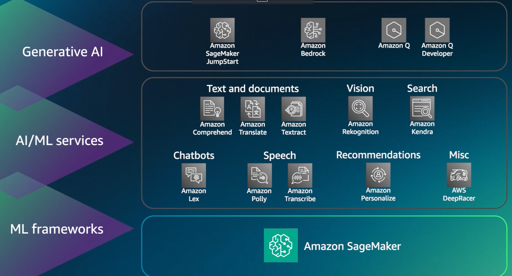

# 인공지능
- AI,ML,DL 및 생성형 AI, 각 용어의 정의
- AI: 지각,추론, 학습, 문제 해결 및 의사 결정과 같이 일반적으로 인간의 지능이 필요한 테스크를 수행할 수 있는 지능형 시스템의 개발을 아우리는 광범위한 분야, AI는 기계 학습, 딥러닝, 생성형 AI등 다양한 기술과 접근 방식을 포괄하는 용어로 사용됨

- ML: 기계가 학습할 수 있게 만드는 방법을 이해하고 구축하기 위한 AI의 하위 집합, 데이터를 사용하여 다양한 테스크에 대한 컴퓨터 성능을 향상시킴

- DL: 딥러닝은 우리 뇌의 연결 방식과 유사한 뉴런 및 시냅스 개념을 사용합니다.

- 생성형 AI: 딥러닝의 하위 집합으로 딥러닝을 사용하여 구축된 모델을 재훈련이나 파인 튜닝 없이 적용할 수 있기 때문
    - 생성형 AI는 훈련 데이터에서 학습한 패턴과 구조를 기반으로 새로운 데이터를 생성할 수 있음
    - 대화, 스토리, 이미지,비디오,음악, 코드를 포함한 새로운 콘테츠를 생성할 수 있음

## 실제 사용 사례의 예
### 미디어 및 엔터테이먼트
- 콘텐츠 생성: AI는 영화, TV프로그램, 게임의 스크립트, 대화문, 전체 스토리를 생성할 수 있습니다.
- 가상 현실 : AI는 게임이나 시뮬레이션을 위한 몰입형 및 대화형 가상 환경을 생성할 수 있습니다.
- 뉴스 생성 : AI는 원시 데이터 또는 이벤트를 기반으로 기사 또는 요약을 생성할 수 있습니다.
### 소매
- 제품 리뷰 요약 : AI는 소비자가 관련 정보를 빠르게 찾을 수 있도록 제품 리뷰 요약을 생성할 수 있습니다.
- 가격 최적화 : AI는 다양한 가격 책정 시나리오를 모델링하여 수익을 극대화하는 최적의 가격 책정 전략을 결정할 수 있습니다.
- 가상 피팅 : AI는 가상 피팅이 가능하도록 고객의 가상 모델을 셍상헤 온라인 쇼핑 경험을 개선할 수 있음
- 매장 레이아웃 최적화: 가장 효율적인 레이아웃을 생성, 고객 쇼핑 경험을 개선하고 매출을 높일 수 있음

### 의료 
- AWS HealthScribe: 이 AWS 서비스는 의료 SW 공급업체가 환자와 임상의간의 대화를 분석해 임상 노트를 자동으로 생성하는 임상 APP을 구축하도록 지원함
- 의료 개인화 : 환자의 특정 유전자 구성, 라이프스타일, 질병 진행도에 따라 치료 계획을 생성해 보다 효과적이고 개인화된 치료에 기여할 수 있음
- 의료 영상 개선 : 엑스레이,MRI,CT 스캔같은 의료 이미지를 향상,재구성 또는 생성하여 더 나은 진단에 도움을 줌

### 생명 과학
- 신약 개발 : 약물의 새로운 잠재적 분자구로를 생서앻 신약 개발 과정을 가속화하고 비용을 절감할 수 있음
- 단백질 접힘 예측 : 아미노산 서열을 기반으로 단백질의 3D구조를 예측할 수 있고, 이는 질병을 이해하고 새로운 치료법을 개발하는데 매우 중요함
- 합성 생물학 : 변형 유기체 또는 생물학적 회로와 같으 합성 생물학적 시스템을 위한 설계를 생성할 수 있음

### 금융 서비스
- 사기 행위 탐지 매커니즘 : 자금 세탁 패턴을 시뮬레이션해 AI/ML 시스템을 개선하기 위한 합성 데이터세트를 생성하는데 도움을 줄 수 있음
- 포트폴리오 관리 : 다양한 시장 시나리오를 시뮬레이션하여 강력한 투자 포트폴리오를 생성하고 과닐하는데 도움을 줄 수 있음
- 채권 추심 : 채권 추심에 가장 효과적인 커뮤니케이션 및 현삽 전략을 생성해 추심 성공유를 높임

### 제조 
- 예측 유지 보수 : 과거 생산 데이터를 분석하여 가장 효율적인 기계 생산량을 제공하고 가동 중단 시간을 줄이기 위한 유지 관리 일정을 예측할 수 있음
- 프로세스 최적화 : AI는 다양한 시나리오를 모델링하고 비용,시간,리소스 사용량 등의 변수를 최적화하여 가장 효율적인 생산 프로세스를 생성할 수 있음
- 제품 설계 :  설정된 파라미터와 제약 사항을 기반으로 새로운 제품 디자인을 생성할 수 있음, 여러 설께 옵션을 생서앟고 비용,재료,성능 등과 같은 요소를 최적화할 수 있음
- 재료 과학 : 원하는 특성의 새로운 재료 구성을 생성하는데 도움을 줄 수 있음

## AI 애플리케이션의 예
### 컴퓨터 비전
-이미지 및 비디오를 해석하고 이해할 수 있게 해주는 인공지능 분야
1. 자율 주행 : 자동차 제조업체는 CV를 사용해 더 안전하고 신뢰할 수 있는 자율 주행 자동차를 개발할 수 있음
- 비즈니스 가치 : 고객 경험 개선
2. 의료 또는 의료 영상 : CV를 사용하면 의료 진단의 정확도와 속도를 향상시켜 치료 결과를 개선하고 환자의 기대 수명을 늘릴 수 있습니다.
- 비즈니스 가치 : 비즈니스 운영 개선
3. 공공 안전 및 가정 보완 : 이미지 및 안면 인식은 무단 출입 또는 고나심 대상자를 신속하게 식별할 수 있어 보다 안전한 지역 사회를 조성하고 범죄를 억제하는 역할을 함
- 비즈니스 가치 : 고객 경험 개선 

### NLP
1. 보험 : 보험 증권 번호, 만기일 및 기타 개인정보를 추출할 수 있음
- 비즈니스 가치 : 민감한 데이터 수정
2. 통신 : 고객 문제 메시지 분석, 개인화된 관장 사항을 제안
- 비즈니스 가치: 고객 참여
3. 학생들이 Q&A 챗봇을 사용해 질문을 대답
- 비즈니스 가치: 학생 경험 및 참여 개선

### IDP(지능형 문서 처리)
1. 금융 서비스 또는 대출 : 주담대 신청서에 중요한 정보를 추출하여 고객 대응 시간을 단축, 부롼전한 대출 패키지 세금 양식, 금여 명세서 및 기타 누락된 데이터를 식별해 대출 승인 절차 지원
- 비즈니스 가치 : 비즈니스 운영 개선, 자동화
2. 법무 : OCR및 NLP와 같은 다른 애플리케이션과 함꼐 사용하면 계약서류,법정 제출 서류, 법적 서류와 같은 문서를 수동으로 처리하지 않아도 됨
- 비즈니스 가치: 비즈니스 운영 개선
3. 의료 : 보험 청구서, 병원 진단서와 같은 다양한 문서 유형을 처리하여 비즈니스를 빠르고 정확하게 처리할 수 있음
- 비즈니스 가치 : 비즈니스 운영 개선/ 

### 사기행위 탐지 : 
1. 금융 서비스 : 신원 확인, 결제 사기 행위 탐지, 거래 감시, 자금 세탁 방지(AML) 제재에 사기 행위 탐지를 사용함
- 비즈니스 가치 :비즈니스 운영 개선
2. 소매 : 기업을 재정적 손실로부터 보호하고 고객 계정 및 데이터를 보호하며 온라인 거래에 대한 신뢰와 확신을 유지합니다.
- 비즈니스 가치: 비즈니스 운영 개선
3. 통신 
    - 통신 : 로밍, 프리미엄 요금 서비스 및 구독 사기
    - 온라인 : 신규 계정 사기, 보험 청구 처리 사기, 프로모션 부정사용
    - 소매 : 신용 카드 및 온라인 소매 사기
- 비즈니스 가치 : 비즈니스 운영 개선

## ML
### AI와 ML이 적절한 솔루션인 경우
- 규칙을 코딩하기 어려운 경우 : 단순한 규칙 기반 솔루션으로는 많은 인간 작업을 제대로 해결할 수 없음, 규칙이 너무 많은 요소에 따라 결정되거나 중복되거나 세밀하게 조정해야 하는 경우 규칙을 정확하게 코딩하기 어려움, ML은 이러한 종류의 문제를 효괒거으로 해결하는데 사용할 수 있음
- 프로젝트가 대규모인 경우 : ML 솔루션은 대규모 문제에 적합함

### AI 및 ML의 대안
- 계산 또는 미리 결정된 단계를 사용하여 목표값을 확인할 수 있는 경우 ML이 필요하지 않음, 데이터 기반 학습 업이도 단계를 프로그래밍 할 수 있음

## ML 기법 및 사용 사례
### 지도 학습
- 레이블이 지정된 훈련 데이터가 지도자임, 지도 알고리즘은 예시를 통해 학습해야함, 이러한 알고리즘 유형은 훈련 데이터를 사용해 입력과 출력 간의 패턴 및 연관성을 판단함, 사람이 레이블을 지정한 자동차 사진으로 훈련을 한경우 모델은 레이블이 지정되지 않은 새 자동차 사진을 받으면 사진이 자동차임을 예측할 수 있음
#### 지도 학습 유형
1. 분류 : 훈련된 모델을 기반으로 보이지 않는 새로운 데이터 인스턴스에 레이블 또는 범주를 할당하는데 사용되는 지도 학습 기법 모델은 각 인스턴스가 이미 알려진 클래스 또는 범주에 할당되어 있는 레이블이 지정된 데이터세트로 훈련합니다. 분류의 목표는 훈련 데이터에서 패턴을 학습하고 이를 사용해 레이블이 지정되지 않은 데이터 인스턴스의 클래스 또는 범주를 예측하는 것
- 사용 사례 : 사기 행위 탐지, 이미지 분류, 고객 유지, 진단
2. 회귀 : 하나 이상의 입력 변수를 기반으로 연속 또는 숫자 값을 예측하는데 사용되는 지도 학습 기법, 종속 변수(예측할 값)와 하나 이상의 독립 변수(예측에 사용되는 특성 또는 입력)간의 관계를 모델링하는 데 사용됨
- 사용 사례 광고 인기 예측, 기상 예보, 시장 예측, 기대 수명 추정, 인구 증가 예측
### 비지도 학습
- 레이블이 지정되지 않은 데이터를 기반으로 모델을 훈랸, 알고리즘은 사전 정보나 지침 없이 데이터 내에 숨겨진 패턴 또는 구조를 발견하려고 함
- 이러한 유형은 기계가 레이블 자체를 발견하고 생성해야함, 제시된 데이터를 사용하여 전체 데이터 집합에서 나타는 속성을 감지한 후 패턴을 구축함 
### 비지도 ML의 유형
1. 클러스터링
- 일반적 하위범주, 특정 클러스터의 속성을 더 잘 파악하기 위해 데이터 포인트 간의 유사한 특성 또는 거리를 기준으로 데이터를 여러 클러스터로 그룹화함
- 사용 사례 : 고객 세분화, 타겟 마케팅, 권장 시스템

2. 차원 축소
- 가장 중요한 정보 또는 패턴을 보존하면서 데이터세트의 특성 또는 차원의 수를 줄이는데 사용되는 비지도 학습 기법 
- 사용 사례 : 빅 데이터 시각화, 의미 있는 압축, 구조 발견, 특성 도출

### 강화학습(RL)
- 이전 바복에서 얻은 피드백을 마이닝하여 모델을 지속적으로 개선, RL에서 에이전트는 환경에서 상호 작용하면서 시행착오를 거쳐 지속적으로 학습함. RL은 원하는 결과에 대한 보상이 알려져 있지만 이를 실현하기 위한 경로가 알려자 있지 않으며 경로를 발겨하기 위해 많은 시행착으로 거처야 하는 경우에 폭넓게 사용할 수 있음
- EX) AWS DeepRacer 시뮬레이터 

# 생성형 AI
## 생성형 AI의 기능
- 데이터 입력과 같은 지루한 테스크를 자동화 하고 데이터를 분석하여 패턴 및 추세를 식별할 수 있으며, 이를 통해 조직은 정보에 입각한 의사 결정을 내릴 수 있음
### 적응성
- 데이터로부터 학습하고 특정 컨테스트 또는 요구 사항에 맞는 콘텐츠를 생성함으로 다양한 테스크 및 도메인에 적응할 수 있음, 생성현 AI는 유연하기 때문에 다양한 산업의 광범위한 애플리케이션에 사용할 수 있음
### 응답성
- 실시간으로 콘텐츠를 생성할 수 있으므로 응답시간이 단축되고 역동적인 상호작용이 가능함, 이는 챗봇, 가상어시스턴스 및 기타 대화형 애플리케이션에 특히 유용함
### 간편성
- 콘텐츠 제작 프로세스를 자동화하여 복잡한 테스크를 간소화할 수 있음
### 창의성 및 탐구
- 요소를 고유한 방식으로 결합 및 재결합하여 새로운 아이디어, 디자인 또는 솔루션을 생성할 수 있음, 창의성과 새로운 가능성에 대한 탐구를 촉진할 수 있음
### 데이터 효율성
- 비교적 적은 양의 데이터로부터 학습하고 훈련 데이터와 일치하는 새로운 샘플을 생성할 수 있음. 이는 데이터가 부족하거나 구하기 어려울 때 유용하게 사용할 수 있음
### 개인화 
- 개인의 취향 또는 특성에 맞는 맞춤형 콘텐츠를 생성하여 사용자 경험과 참여도를 높일 수 있음
### 확장성
- 대량의 콘텐츠를 빠르게 생성할 수 있음, 모델은 대규모 콘텐츠 제작이 필요한 테스크에 적합함

## 생성형 AI의 과제
- 문제를 고려하는게 중요하다
### 규정 위반
- 위험 : 민감한 데이터로 훈련된 모델은 의도치 않게 개인 식별 정보(PII) 노출과 같은 규정을 위반하는 출력을 생성할 수 있음
- 완화 : 개인 정보 보호 침해 위협을 최소화 하려면 모델 훈련 중 엄격한 데이터 익명화 및 프라이버시 보존 기술을 구현해야함, 개인정보보호 규정을 준수하려면 사용된 데이터에 대한 철저한 감사 및 평가를 수행해야함
### 사회적 위험
- 위험 : 원치 않는 코텐츠가 조직에 부정적인 영향을 미칠 수 있는 가능성이 사회적 위험
- 완화 : 배포전에 모든 모델을 평가하고 테스트함

### 보안 및 개인 정보 보호 우려 사항
- 위험 : 모델과 공유한 정보에는 개인정보가 퐇마될 수 있으며 잠재적으로 개인정보 보호법에 위배될 수 있음
- 완화 : 민감한 데이터를 보호하기 위해 암호화, 방화벽 같은 사이버 보안 조치를 구현

### 유해성
- 위험 : 선동적,불쾌,부적절한 콘텐츠 생성 가능
- 완화 : 문구를 미리 식별하고 훈련 데이터에서 제거해 훈련 데이터를 큐레이션, 출력으로 생성되는 것을 방지가능,
        - 가드레일 모델을 사용함, 이런 모델은 원치 않는 콘텐츠를 탐지해 필터링함

### 할루시네이션
- 위험 : 모델이 훈련 데이터와 일치하지 않는 부정확한 응답을 생성함
- 완화 : 사용자에게 모든것을 확인해야 함을 알려줌, FM이 내뱉은 것을 현실 및 사실에 근거하는지 검증했을지 신뢰할 수 없음, 독립적인 소스를 통해 콘테츠를 검증했는지 확인하면 할루시네이션을 완화할 수 있음. 생성된 콘텐츠를 검증되지 앟은 것으로 표시해 사용자에게 확인이 필요하다고 경고할 수 있음

### 해석 가능성
- 위험 : 사용자가 모델의 출력을 잘못 해석할 수 있으며, 이로 잘못된 결론 또는 결정을 내릴수 있음
- 완화 : 데이터 모델 입력에 대한 주요 정보를 제공하여 모델 개발 및 성능에 대한 특정 도메인 지식을 활용함

### 비결정성
- 위협 : 모델은 동일한 입력에 대해 다른 출력을 생성할 수 있으며, 이로 인해 신뢰성이 중요한 애플리케이션에서 문제가 발생할 수 있음
- 완화 : 모델에 대한 테스트를 수행하여 비결정성의 원인을 식별함, 모델을 여러 번 실행하고 출력을 비교하여 일관성을 보장함

## 생성형 AI를 선택할 때 고려할 사항
1. 모델 유형
2. 성능 요구 사항
3. 기능
4. 제약 조건
5. 규정 준수

### 모델
- 상업 모델인듯
1. A121 labs (Jurassic-2 Models)
- 태스크 : 텍스트 생성, 요약, 패러프레이징, 채팅, 정보 추출
- 사용 사례 : 금융 서비스 - 긴 문서 요약, 소매 - 제품 설명 생성
2. Amazon (Amazon Titan) 
- 태스크 : 텍스트 요약, 분류, 개방향 Q&A, 정보 추출, 임베딩, 검색
- 사용 사례 : 광고 - 스튜디오 품질의 이미지 제작, 고객 서비스 - 실시간 초록 생성
3. Cohere (Command)
- 테스크 : 텍스트 생성, 정보 추출, 질문 및 답변, 요약
- 사용사례: 고객 서비스 - 지원 챗봇, 소매 - 제품 설명 제공, 의료 - 긴 텍스트에서 핵심 아이디어 요약

### 성능 요구 사항
- 출력의 정확성, 신뢰성 등이 포함됨. 모델의 전체 성능을 평가해 특정 테스크에 대한 적합성 평가, 데이터세트에 대해 모델을 테스트해 신뢰성 확보, 시간 경과에 따라 성능을 모니터링해 일관성 유지

### 제약 조건
 - 컴퓨팅 리소스
 - 데이터 가용성
 - 배포 요구 사항
        - 일부 모델은 리소스 요구량이 높거나 특정 HW 구성이 필요할 수 있음, 이는 사용사례 영향을 미칠 수 있음
 ### 기능
 - 모델의 긔능, 다양한 수준의 출력 품질 및 제어 또는 사용자 지정으로 다양한 테스크를 수행할 수 있음, 생성형 AI 모델을 선택하기 전 애플리케이션에 필요한 특정 기능을 이해하는 것이 중요함

### 규정 준수
- 편향, 개인 정보 보호 문제, 오용 가능성 등의 문제를 야기할 수 있음. 의료,금융,법률 처럼 민감한 애플리ㅔ이션에서 특정 모델을 평가할 때 해당 모델의 규정 준수 및 영향을 고려해야함, 공정성, 투명성 또는 추적성, 책임성, 할루시네이션, 유해성등의 요소를 고려해야함, 모델은 관련 구정 및 지침을 준수해야함

### 비용
- 모델의 크기와 속도 사이의 절충을 고려해야함, 모델이 클수록 정확성도 높, 비용 많이 들고 배포 옵션이 적어짐. 반대면 비용이 적게들고, 속도 빠르고 더 많은 배포 대안을 제공함

## 생성형 AI의 비즈니스 지표
1. 사용자 만족도
2. 사용자당 평균 수익
3. 크로스 도메인 성능 
4. 전환율 
5. 효율성 

# 기계학습 기본 사항
## 훈련 데이터
- 기계 학습 프로세스는 훈련 데이터를 수집하고 처리하는 것으로 시작됨, 불량 데이터를 가비지 인, 가비지 아웃이라고 하며, ML 모델 성능은 훈련에 사용되는 데이터 품질에 비례함, 데이터 준비 및 처리는 때떄로 일상적인 프로세스지만 전체 모델이 의도대로 작동할지 아니면 성능을 저하할지 결정하는 가장 중요한 단계
1. 레이블 지정 데이터
2. 레이블 미지정 데이터 
3. 정형 데이터 : DB형태로 사전 정의된 방식으로 구성되고 형식이 지정되는 데이터
    - 표 형식 데이터 :
    - 시계열 데이터 : 주가, 센서 판독값, 날씨 데이터와 같이 연속적인 시점에 측정된 값의 시퀀스로 구성됨
4. 비정형 데이터 : 텍스트,이미지,오디오,비디오등과 같이 사전 정의된 구조나 형식이 없는 데이터, 의미 있는 패턴과 인사이트를 추출하기 위한 고급 기계 학습 기술이 필요함

## ML 학습 알고리즘 
1. 지도학습
2. 비지도 학습
3. 강화 학습

## 추론
- 모델이 학습한 정보를 사용해 예측을 수행하거나 의사를 결정하는 프로세스
- 두가지 유형으 ㅣ추론이 있음
1. 일괄 추론
    - 컴퓨터가 이미지나 테스트와 같은 대량의 데이터를 가져와 한꺼번에 분석하고 일련의 결과를 제공하는 것이 일괄추론, 데이터 분석과 같은 테스크에 자주 사용(의사 결정 프로세스의 속도가 결과의 정확성마큼 중요하지 않은 테스크)
2. 실시간 추론
    - 새 정보에 대응해 컴퓨터가 신속하게 결정을 내려야 할 때 사용, 챗봇이나 자율주행자동차같이 즉각적인 의사결정이 중요한 애플리케이션에 중요함

# 딥 러닝 기본 사항
## 신경망
- 계층은 입력계층 하나, 하나 이상의 은닉 계층, 출력 계층 하나로 구성됨
- 관련 AI분야 : CV, NLP

# 생성형 AI 기본 사항
## FM(파운데이션 모델)
- 생성형 AI는 인터넷 규모의 데이터로 사전 훈련된 모델로 구동되며 이것을 FM이라고 함,

### FM 수명 주기
1. 데이터 선택 : 레이블 미지정 데이터는 레이블 지정 데이터에 비해 획득하기 쉬워 사전 훈련에 대규모로 사용할 수 있음, FM은 다양항 소스의 대규모 데이터세트로 훈련해야함, 
2. 사전 훈련 : FM은 일반적으로 자가 지도 학습을 통해 사전 훈련됨, 학습 데이터 내부 구조를 활용해 레이블을 자동으로 생성, 초기 사전 훈련 후 추가 데이터를 기반으로 모델을 추가로 사전훈련 할 수 있음, 지속적 사전 훈련이라고 함, 모델의 지식 기반을 확장하고 다양한 영역 또는 테스크에 대한 이도 및 일반화 능력을 향상하는 것이 목적
3. 최적화
4. 평기
5. 베포
6. 피드백 및 지속적 개선

## LLM
- 가장 일반적인 아키텍처는 트랜스포머 모델, 이것은 사람과 유사한 텍스트를 이해하고 생성할 수 있는 강력한 모델, 방대한 양의 텍스트 데이터로 훈련 받으며, 단어와 구문간의 패턴과 관계를 학습함

## 디퓨전 모델
### 순방향 확산 
- 시스템은 노이즈만 남을 때까지 입력이미지에 소량의 노이즈를 서서히 가져옴
### 역방향 확산
- 노이즈 이미지를 서서히 가져와 새 이미지가 생성될 때까지 노이즈를 제거

## 멀티 모달 모델
- 텍스트나 이미지와 같은 한 가지 유형의 입력 또는 출력에만 의존하지 않으며, 여러 모드의 데이터를 동시에 처리하고 생성가능
- 이미지와 텍스트 같은 여러 양식이 어떻게 서로 연결되고 영향을 미칠 수 있는지 학습함

## 기타 생성형 모델
- GAN(적대적 생성 신경망)
    - 2개의 신경망이 제로섬 게임 프레임워크에서 서로 경쟁하는 생성형 모델, (생성기와 판별자)
    - 생성기 : 임의의 노이즈를 입력으로 받아 훈련 데이터 분포와 유사한 데이터로 변환하여 새로운 합성 데이터를 생성
    - 판별자 : 훈련 세트의 실제 데이터와 생성기가 생성한 합성 데이터를 입력으로 상요함, 실제 데이터와 생성된 데이터를 구별
- VAE(뼌이형 오토 인코더)
    - 오토인코더(신경망의 일종)와 변이 추론(베이지안 통계 기법)의 아이디어를 결합한 것, 두 부분으로 구성됨
    - 인코더 : 입력 데이터를 가져와 데이터의 필수 특성을 캡처하는 저차원 잠재 공간에 매핑함
    - 디코더 : 인코더의 잠재 표현을 가져와 원래 입력 데이터를 재구성함
    - VAE의 주요 특징은 잠재 공간이 특정 확률 분포(가우스 분포)를 따르도록 장려한다는 것, 잠재공간에서 샘플링하고 샘플을 디코더에 전달하여 새 데이터를 생성할 수 있음

## 모델 출력 최적화
- FM 모델 수명주기의 핵심은 최적화 단계. FM은 여러 방법으로 최적화 할 수 있음. 최적화 기술의 복잡성과 비용은 천차만별이며, 가장 빠르고 저렴한 방법은 프롬프트 엔지니어링
### 프롬프트 엔지니어링
- FM모델의 지침 역할을 함, 고객의 요구에 맞게 프롬프트를 개발, 설계, 최적화하여 FM의 출력을 향상함, 프롬프트 엔지니어링은 고객이 원하는 결과로 모델의 동작을 안내하는 방법을 제공함
- 프롬프트의 형식은 모델에 부여하는 태스크에 따라 달라짐, 예제에서 다음 요소의 일부 또는 전체가 포함된 프롬프트를 검토하게 됨
1. 지침 : FM이 수행할 태스크 입니다. 모델이 해야할 테스크에 대한 설명이나 지침을 제공함
2. 컨텍스트 : 모델을 안내하는 외부 정보
3. 입력 데이터: 고객이 응답을 원하는 입력
4. 출력 지표 : 출력 유형 또는 형식

>예제: 당신은 긴 기사를 간결한 요약문으로 압축하는 데 탁월한 능력이 있는 노련한 저널리스트입니다. 다음 텍스트를 2~3문장으로 요약하십시오.
>텍스트: [여기에 긴 기사 텍스트 삽입]

### 미세 조정 fine tunning
- FM은 자가 지도 학습을 통해 사전 훈련되며 정보를 이해하는 능력이 있지만, FM 기본 모델을 미세 조정하여 성능을 높일 수 있음, 미세 조정은 미리 훈련된 모델을 갖와서 좀 더 구체적이고 작은 데이터 세트를 추가하면 테스크에 더 적합하게 데이터의 가중치가 수정됨 
#### 미세조정 방법
- 지침 미세 조정 : 모델이 특정 지침에 어떻게 대응해야 하는지 보여주는 예제를 사용합니다. 프롬프트 튜닝은 일종의 지침 미세조정입니다.
- 인간 피드백 기반 강화 학습(RLHF) : 피드백 데이터를 제공해, 결과적으로 인간 선호도에 더 잘 맞는 모델이 생성됨
- 업계 지식이 필요한 테스크를 수행하는 경우 사전 훈련된 모델을 가져와서 업계 데이터로 미세 조정할 수 있음

## RAG 검색 증강 생성
- 도메인 관련 데이터를 컨텍스트로 제공하여 해당 데이터를 기반으로 응답을 생성하는 기법, 이 기법은 미세조정과 유사함
- RAG는 소규모 레이블 지정 예제 집합으로 FM을 미세조정할 필요 없이, 소규모 관련 문서를 검색하고 상요하여 사용자 프롬프트에 답변하기 위한 컨텍스트를 제공함, 미세조정은 파운데이션 모델 가중치를 변경하지만 RAG는 변경하지 않음

# AWS 인프라 및 기술
- AWS가 제공하는 포괄적인 ML 및 생성형 AL 서비스 제품군 
- Amazon Comprehend를 사용한 텍스트의 이해부터 Amazon Q Developer를 사용한 코드 생성 

## AWS AI/ML 서비스 스택

- 스택은 프레임워크 계층에서 시작됨 해당 계층의 핵심은 Amazon SageMaker
    - SageMaker는 사용자 지정 모델을 구축,훈련,배포하는 데 사용할 수 있는 완전관리형 기계 학습 서비스, ML 개발 및 배포 수명 주기를 가속화하는 도구와 인프라를 제공
- 다양한 사용 사례에 맞게 조정된 방대한 전문 서비스를 찾을 수 있는 AI/ML 서비스 계층 
    - 자연어를 처리하는 Amazon Comprehend, 번역하는 Amazon Translate ,스캔한 문서에서 데이터를 추출하는 Amazon Textract
    - 챗봇은 Amazon Lex, 이거 사용하면 Amazon Alexa를 구동하는 동일한 딥러닝 기술 기반의 대화형 인터페이스를 구축할 수 있음
    - 음성 영역에는 텍스트를 음성으로 변환하는 Amazon Polly, 음성을 자동 인식하는 Amazon Transcibe가 있음
    - 비전영역은 다양한 애플리케이션의 이미지와 비디오를 부석하는 Amazon Rekognition
    - 검색 웹 사이트 및 애플리케이션의 기업 검색을 재구성하는 Amazon Kendra
    - 개인화 하고 추천할 수 있는 Amazon Personalize가 있음
    - RL을 경험할 수 있는 1/18 스케일 완전 자율 주행 경주용 자동차인 AWS DeepRacer
- 생성형 AI 계층     
    - 일반적인 사용 사례에 대한 솔루션 세트를 제공하는 Amazon Sagemaker JumpStart
    - Amazon Bedrock은 API를 통해 아마존과 선도적인 AI 스타트업의 FM을 사용할 수 있는 완전 관리형 서비스, 해당 서비스를 이용하면 빠르게 FM을 실험하고, 자체 데이터를 사용해 비공개로 FM을 사용자 지정하고 FM을 AWS 애플리케이션에 원활하게 통합하고 배포할 수 있음 - 실험을 위해선 Aamzon Bedrock Playground인 PartyRock을 사용해 직접 체험 가능
    - 업무용으로 설계되었으며 기업의 데이터에 맞게 조정할 수 있는 Amazon Q, Amazon Q Developer이건 ML에 맞는 코드제공

## AWS AI 솔루션의 장점 및 이점
- 생성형 AI를 사용하는 자체 사용자 지정 AI 애플리케이션을 구축하고 확장할 수 있음, 해당 애플리케이션은 고객의 요구사항에 맞게 조정할 수 있음, AWS는 생성형 AI 기술을 사용해 독특하고 개인화된 앱을 생성할 수 있도록 지원

### 장점 
1. 개발 및 배포 가속화
- Amazon Q Developer는 실시간으로 코드를 생성할 수 있음
- SageMaker는 데이터 전처리, 모델 훈련, 배포 등의 태스크를 처리
- Amazon Bedrock은 사전 훈련된 모델과 API를 제공함, 광범위 한 훈련이나 특수 HW없이도 AI기능을 애플리케이션에 빠르게 통합할 수 있음
2. 확장성 및 비용 최적화
- 종량제 가격 책정 모델이 적용되니까 사용한 만큼만 리소스 비용 지불하면됨
- AWS 글로벌 인프라 및 분산 컴퓨팅 기능을 통해 리전 간에 원활하게 애플리케이션 규모를 조정하고 대규모 데이터세트 또는 대량의 트래픽을 처리할 수 있음
3. 유연성 및 모델 접근성
- AWS는 AI서비스를 지속ㅈ거으로 업데이트 및 확장하여 첨단 ML 모델, 기법, 알고리즘을 제공
- Amazon Bedrock은 단일 API를 통해 선도적인 AI 회사의 고성능 FM을 사용할 수 있음음
4. AWS 도구 및 서비스와 통합
- Amazon Comprehend 및 Amazon Rekognition과 같은 서비스는 애플리케이션에 바로 통합할 수 있는 즉시 사용 가능한 AI 기능을 제공
- AWS AI 서비스는 다른 AWS 서비스와 원활하게 통합되므로, 개발자가 여러 클라우드 서비스를 사용하는 엔드투엔드 솔루션을 구축할 수 있
- AWS 에코시스템은 다양한 도구, SDK 및 API를 제공하므로, 개발자가 AI 기능을 기존 애플리케이션에 통합할 수도 있고 완전히 새로운 AI 기반 애플리케이션을 개발할 수도 있음

## 비용 고려 사항
- 각 서비스의 장단점은 응답성, 가용성,중복성, 성능, 리전 커버리지, 가격 책정 모델, 처리량, 사용자 지정 모델 사용 능력등의 요소에 영향을 미칠 수 있음
    - AWS 생성형 AI 서비스는 응답성과 가용성이 뛰어나도록 설계되었습니다. 그러나 응답성과 가용성이 높아지면 대부분 더 많은 비용이 발생합
    - 중복성과 고가용성을 보장하려면 AWS 생성형 AI 서비스를 여러 가용 영역 또는 여러 AWS 리전에 배포하면 됩니다. 이렇게 중복으로 구성하면 여러 위치에 리소스를 프로비저닝하고 데이터를 복제해야 하므로 추가 비용이 발생
    - AWS는 생성형 AI 서비스를 위한 다양한 컴퓨팅 옵션 을 제공합니다. GPU 인스턴스와 같은 고성능 옵션은 일반적으로 더 많은 비용이 들지만 특정 워크로드의 성능을 대폭 향상할 수 있
    - Amazon Q Developer 및 Amazon Bedrock과 같은 많은 AWS 생성형 AI 서비스가 토큰 기반 요금 모델을 사용함, 처리한 토큰 수(텍스트 또는 코드 단위)에 따라 비용이 발생합니다. 더 많은 토큰을 생성하거나 처리할수록 더 많은 비용이 발생함
    - Amazon Polly 및 Amazon Transcribe와 같은 일부 AWS 생성형 AI 서비스는 특정 양의 처리량을 미리 프로비저닝할 수 있음, 프로비저닝된 처리량이 많을수록 더 많은 비용이 발생하지만 시간이 중요한 워크로드의 경우 예측 가능한 성능을 보장할 수 있
    - AWS는 다양한 생성형 AI 태스크를 위해 사전 훈련된 모델을 제공하지만, 자체 사용자 지정 모델을 가져오거나 기존 모델을 미세 조정할 수도 있습니다. 사용자 지정 모델을 훈련하고 배포하면 모델의 복잡성, 훈련 데이터 및 필요한 컴퓨팅 리소스에 따라 추가 비용이 발생할 수 있음

# Developing Machine Learning Solutions (Korean)
## 기계 학습 개발 수명 주기
- ML 수명 주기는 기계 학습 모델을 개발, 배포, 유지 관리하는 엔드 투 엔드 프로세스를 나타냄
- 엔드 투 엔드 기계 학습 수명 주기 프로세스에 포함되는 단계
1. 비즈니스 목표 식별
2. ML 몬제 프레이밍
3. 데이터 처리(데이터 수집, 데이터 전치리 및 특성 추출)
4. 모델 개발(훈련,튜닝 및 평가)